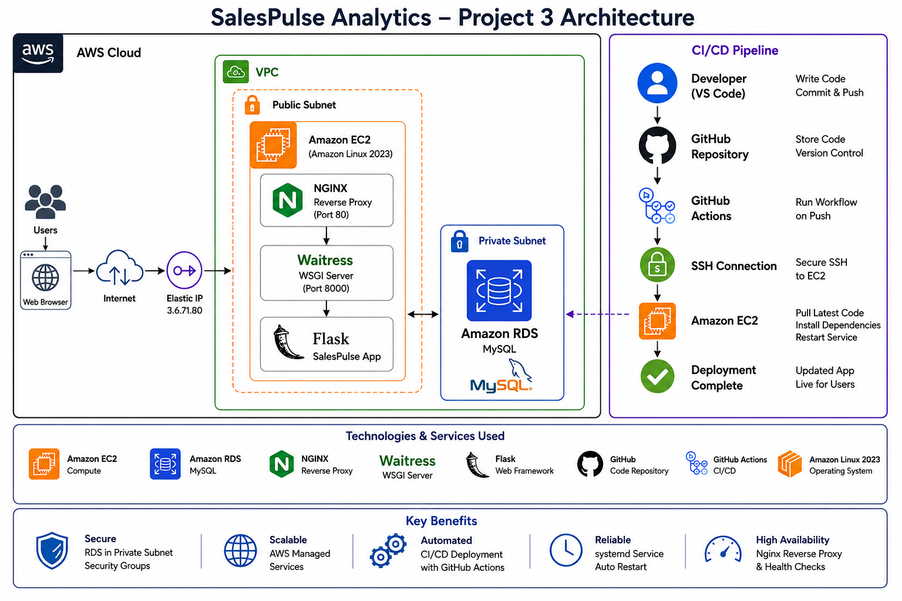

# SalesPulse Analytics Dashboard

## Architecture Diagram



## Project Overview

SalesPulse is a production-style Flask web application deployed on AWS that allows users to record sales transactions and view revenue analytics through a web dashboard.

The project demonstrates a complete DevOps deployment workflow including infrastructure provisioning, Linux service management, reverse proxy configuration, database integration, and automated CI/CD deployment using GitHub Actions.

---

## Architecture

```text
User Browser
      │
      ▼
Elastic IP
      │
      ▼
NGINX Reverse Proxy
      │
      ▼
Waitress WSGI Server
      │
      ▼
Flask Application
      │
      ▼
Amazon RDS MySQL
```

### Deployment Pipeline

```text
Developer
    │
    ▼
GitHub Repository
    │
    ▼
GitHub Actions
    │
 SSH Deployment
    │
    ▼
Amazon EC2
```

---

## Tech Stack

### Cloud

* AWS EC2
* AWS RDS MySQL
* Elastic IP
* Security Groups

### Backend

* Python
* Flask
* Waitress

### Database

* MySQL

### Web Server

* NGINX

### CI/CD

* Git
* GitHub
* GitHub Actions

### Operating System

* Amazon Linux 2023

---

## Features

* Add sales records
* Revenue tracking dashboard
* MySQL database persistence
* Responsive UI
* Reverse proxy using NGINX
* Production deployment using Waitress
* Automated deployment using GitHub Actions
* Automatic service restart using systemd

---

## Infrastructure Components

| Component      | Purpose                |
| -------------- | ---------------------- |
| EC2            | Hosts application      |
| RDS MySQL      | Stores sales data      |
| Elastic IP     | Static public access   |
| NGINX          | Reverse proxy          |
| Waitress       | Production WSGI server |
| systemd        | Process management     |
| GitHub Actions | Automated deployment   |

---

## CI/CD Workflow

1. Developer pushes code to GitHub.
2. GitHub Actions workflow is triggered.
3. Workflow connects to EC2 using SSH.
4. Latest code is pulled from GitHub.
5. Dependencies are installed if required.
6. SalesPulse service is restarted.
7. Updated application becomes available automatically.

---

## Linux Services

### SalesPulse Application

Managed using systemd:

```bash
sudo systemctl status salespulse
```

### NGINX

Managed using systemd:

```bash
sudo systemctl status nginx
```

---

## Project Structure

```text
aws-project-3/
│
├── app/
│   ├── templates/
│   ├── static/
│   └── app.py
│
├── venv/
├── wsgi.py
├── requirements.txt
├── .github/
│   └── workflows/
│       └── deploy.yml
│
└── README.md
```

---

## Key Learning Outcomes

* AWS EC2 administration
* Amazon RDS integration
* Linux service management using systemd
* Reverse proxy configuration using NGINX
* Production deployment using Waitress
* Git and GitHub workflows
* GitHub Actions CI/CD pipelines
* SSH-based automated deployments
* Troubleshooting divergent Git branches
* Infrastructure and application integration

---

## Future Enhancements

* Docker containerization
* Docker Compose deployment
* HTTPS with SSL/TLS
* Monitoring and alerting
* Infrastructure as Code using Terraform
* Kubernetes deployment

---

## Author

Anant Bhatia

GitHub: https://github.com/Ares2211

```
```
